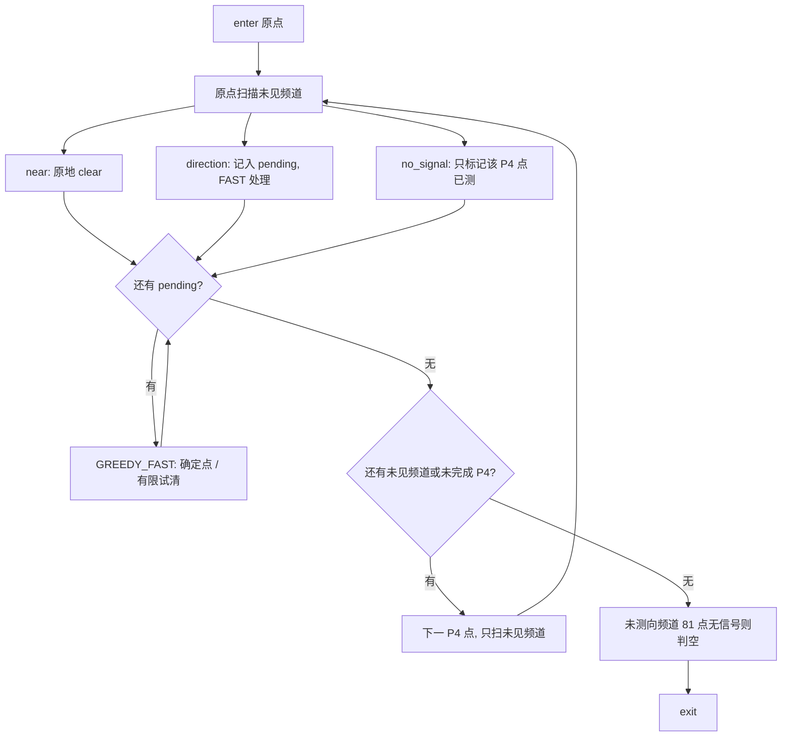

# Q4 策略分层（设计，未实现）

主线思想：用 $P_4$ 做发现证书，用 GREEDY_FAST 清已经测到向的频道。禁止一上来 81×20 全扫。

## 层 0 — 证书网格

访问顺序：原点（若在 $P_4$ 中，已含）+$P_4$ 蛇形（偶数行向东、奇数行向西，行距 600 m）。每到一点只测 **未见且未清除** 的频道，不重复已 `direction` 的频道（那些交给 FAST）。

## 层 1 — 已测向频道 = GREEDY_FAST

与问题 3 主线相同：确定 MEC 则排队清除；否则有限启发式；默认保留 SAFE 式兜底。  
Q4 的 SAFE 不是 Q3 的 225 蛇，而是：**该频道剩余 $P_4$ 点**。不得把 Q3 七点 dist-exclude 网格当定向兜底。

光学试清仍可用：扇外 20 m 内可能清掉。失败 3 s，不更新 `certified_absent`。

## 层 2 — 未测向频道

只靠 $P_4$ 增量。81 点全 `no_signal` 才 `certified_absent`（命题 3）。

## 时间粗算（不是成绩）

蛇形约 80 段 × 600 m / 5 m/s ≈ 9600 s 量级，加上原点。每点频道数随清除下降，不是 81×20×6。顺路 FAST 清掉源后，后续格点少扫频道。上界见 `MODELING_REPORT.md` §6（SAFE 总 $T<50200$ s），只说明不超时，不是最优。

## 实现（寻路与状态，无模拟器入口）

- 状态：`src/q4_state.py`。判空仅当该频道 81 个 $P_4$ 点均为 `no_signal`。
- 下一点：`src/q4_policy.py`。评分
  `score(q)= -α·travel_time + β·newly_certified_points + γ·channel_progress + η·source_clear_priority`，
  默认 `α=1, β=50, γ=20, η=200`（实现权重，非题设常数）。剩余路程用蛇形增量，不在排序阶段跑 $k!$。
- 路径长度：`active.shortest_path_length`：$k\le 8$ Held-Karp，$8<k\le 20$ NN+2-opt，$k>20$ 用 $P_4$ 蛇形。
- 问题4演练入口：`simulator_automation/run_q4_practice.ps1`（Inspect 必须是问题4演练）。禁止问题4正式。
