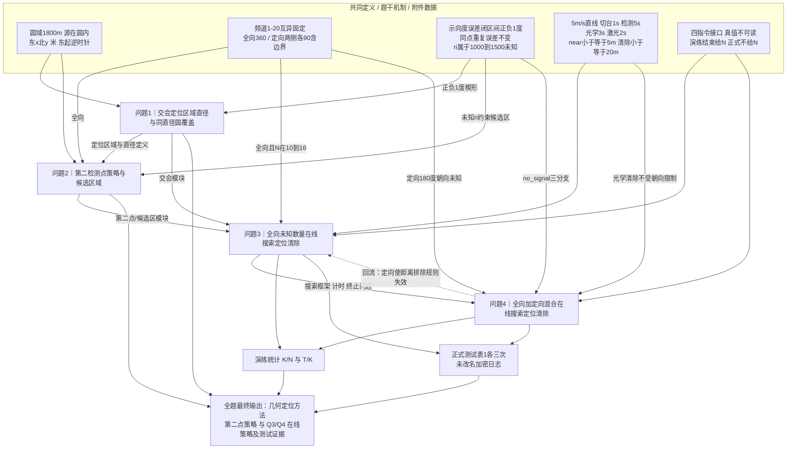

# 赛题分析（由已完成工作区注入，本步已跳过重做）
本赛题共 4 个子问题。分析/建模/编程已在团队工作区完成，本工作流从图表与论文写作开始。

## 统一建模口径（注入）

# B题统一建模口径

- **冻结日期：** 2026-09-10
- **权威台账：** [`B题-题意逐句翻译.md`](B题-题意逐句翻译.md)（BZD 题意翻译器，104 条源单元）
- **数值参数：** [`../data_preparation/parameters.csv`](../data_preparation/parameters.csv)（28 项，与台账一致，不另改数）
- **前序审题笔记：** [`../data_preparation/语义辨析与数据清理.md`](../data_preparation/语义辨析与数据清理.md)（本文件冻结后，冲突以台账+本口径为准）
- **范围：** 只统一定义、单位、约束、交付物与跨问联动；不求解、不写求解代码、不虚构测试成绩。

## 1. 权威层级

| 层级 | 文件 | 用途 |
|---|---|---|
| 1 源文本 | `B题.pdf`、`附件1.docx`、`附件2.docx` | 最终文字以原件为准；图 1、图 2 须回看 PDF |
| 2 题意台账 | `docs/B题-题意逐句翻译.md` | 逐句语义、联动、易误读句的唯一建模入口 |
| 3 本口径 | 本文件 | 把台账收成可执行的符号、谓词、计时与交付约束 |
| 4 参数表 | `data_preparation/parameters.csv` | 冻结数字；禁止在代码里另写一套常数 |
| 5 清洗笔记 | `data_preparation/语义辨析与数据清理.md` | 接口清洗与两局冒烟；不得覆盖 2–4 |

`parameters.csv` 的 28 项与台账无冲突，全部保留。本轮不新增“题设参数”；任何 ±1.005° 一类包络只允许作为**显式数值约定**，不得写进参数表冒充题面。

## 2. 全题冻结符号

坐标系：原点为圆域中心，东 $x$、北 $y$，单位米。方位角从 $+x$ 逆时针，$[0,360)$。跨 0° 用圆周距离，禁止直接减后取绝对值。

| 符号 | 含义 | 已知/未知 | 约束 | 台账 |
|---|---|---|---|---|
| $\Omega$ | 目标圆域 | 已知 | $x^2+y^2\le 1800^2$；**只约束源位置** | B09, ATT2-01 |
| $N$ | 干扰源总数 | 在线未知 | $N\in\{10,\ldots,16\}$；正式测试永不返回 | B10, Q3-01, ATT2-03 |
| $K$ | 本局已成功清除数 | 可观测 | $0\le K\le N$；二次清除不计新成功 | ATT1-03 |
| $c\in\{1,\ldots,20\}$ | 测向机当前频道 | 状态变量 | 初值 1；仅 `/measure` 更新 | Q3-02, ATT2-04 |
| $k$ | 本次指令指定频道 | 可控 | `/measure` 的 $k$ 会改 $c$；`/clear` 的 $k$ 不改 $c$ | ATT1-03 |
| $p,q$ | 上一动作点、本次目标点 | 可控 | 每分量 $\lvert\cdot\rvert\le 2\times 10^6$；**允许出圆** | A3-14, ATT2-01 |
| $G_i$ | 第 $i$ 个源 | 位置未知 | $G_i\in\Omega$；频道互异、时不变 | A1-01 |
| $r_i$ | 源 $i$ 有效接收半径 | 未知 | $r_i\in[1000,1500]$，接口不返回 | A2-08, ATT2-05 |
| $\hat\theta$ | 示向度 `svd_deg` | 有信号时观测 | 真方位 $+\varepsilon$，$\varepsilon\in[-1,1]$ 闭区间；两位小数 | A2-03, A2-07, ATT2-07 |
| $\psi_i$ | 定向朝向 | Q4 未知 | 全向无朝向；定向覆盖为朝向两侧各 90°（含），总宽 180° | A1-03, ATT2-06 |

禁止事项（与台账一致）：

- 不把 1800 m 圆当成机器狗禁出区。
- 不把 $N=10$ 当结束条件，也不把 20 个频道都当成有源。
- 不把示向度当精确射线，不把直径当最小覆盖圆直径。
- 不把场强/RSSI 当接口观测量，不做距离回归。
- 不把 `/clear` 的频道写入测向机寄存器。

## 3. 观测与动作谓词

### 3.1 `/measure` 三值

| 结果 | 几何条件 | 返回 | 计时 |
|---|---|---|---|
| `direction` | 在覆盖内且 $5 < d \le r_i$ | $\hat\theta$，误差 $\pm 1^\circ$ | 5 s（另加移动与切换） |
| `near` | 在覆盖内且 $d\le 5$ | 无角度；**不得填 0°** | 同上 |
| `no_signal` | 无未清除源 **或** $d>r_i$ **或** 定向扇外 | 无角度；负观测，不得丢弃 | 同上 |

覆盖判定用“源 → 检测点”方向；示向度是“检测点 → 源”，相差 180°。5 m、20 m 均为闭边界。

`no_signal` 推理（Q3/Q4 必须分写）：

- **Q3 且已确信该频道仍有未清除全向源：** $d>r_i\ge 1000$。
- **存在性未知（含尚未确认该频道有源）：** 必须保留“该频道无源”分支。
- **Q4：** 不得把 Q3 距离排除原样搬来；第三分支是定向扇外。射频阴影内仍可能 $d\le 20$ 而被光学清除。

同点同频道重复 `/measure`：虚拟时间照付，但误差不变，**不是新的独立测向样本**。

### 3.2 `/clear`

成功 ⇔ 指定频道存在未清除源且欧氏距离 $\le 20$ m；与射频朝向无关、无随机漏检。同一源只能成功一次。

| 结果 | 虚拟耗时 | 状态 |
|---|---|---|
| 成功 | 移动 $+3+2$ | $K\leftarrow K+1$；该频道此后应长期 `no_signal`；测向机频道 $c$ 不变 |
| 未发现 | 移动 $+3$ | 不能据此断言该频道全局不存在；二次清除同此 |

### 3.3 协议时间（不是新假设）

上一合法动作位置 $p$、测向机频道 $c$，本次目标 $q$、指定频道 $k$：

$$
\Delta T_{\mathrm{measure}}=\frac{\|q-p\|}{5}+\mathbf{1}_{k\neq c}+5,\qquad
\Delta T_{\mathrm{clear}}=\frac{\|q-p\|}{5}+3+2\mathbf{1}_{\mathrm{success}}.
$$

速度 5 m/s、直线。`/enter`、`/exit` 不推进虚拟时间。`accepted=false` 的 `virtual_time_s=0` 不得覆盖时钟。

三套时钟不得混用：

| 时钟 | 用途 | 上限 |
|---|---|---|
| 虚拟任务时间 $T$ | 题目效率、$T/K$ | 360000 s |
| 程序运行时间 | 表 1 第四列；`/enter` 至结束的墙钟 | `remaining_real_duration_s`∈[0,1200] |
| 测试窗口 | 接口开放总时长 | 1500 s |

$T$ 必须计入空扫、失败检测、失败清除和终止前搜索。$K=0$ 时 $T/K$ 未定义，留空，不填 0。

## 4. 四问输入 / 任务 / 输出（建模口径）

### 问题 1

- **几何对象（默认）：** 定位区域 $R$ = 各检测点前向闭楔形（示向度 $\pm 1^\circ$）的交集。图 2 两点情形画成四边形；多点为多个楔形交。
- **直径：** $\mathrm{diam}(R)=\max_{p,q\in R}\|p-q\|$，不是最小覆盖圆直径。
- **覆盖性：** 以 $\mathrm{diam}(R)$ 为直径的圆一般**不能**覆盖 $R$。等边三角形是标准反例。论文必须回答此问。
- **退化：** 空集、点、线段、无界楔/条带都必须处理；题面不保证有界非空多边形。
- **命名隔离：** 若再交 $\Omega$ 或 $r_i$ 环，得到的是“可行域”，不得仍称图 2 的纯交会多边形。采用哪个对象属建模选择，见 §6。
- **交付：** 一般算法（题目未给检测点数组）；覆盖性证明或反例。后续若用 $R$ 选清除点，须检查该点到 $R$ 的豪斯多夫半径 $\le 20$ m，不能用 $\mathrm{diam}/2$。

### 问题 2

- **输入：** 一个全向源、一个检测点及其示向度；真位置与 $r_i$ 未知。
- **输出：** 第二点选择策略 **和** 候选区域。
- **“较好”：** 题面未指定指标。禁止把未知真值上的期望误差当题设目标。候选指标（建模时必须显式选一并做敏感性）：$R$ 的直径、最坏点误差、使 $\mathrm{diam}(R)$ 进入可清除尺度的充分条件；移动耗时是否计入须声明。
- **候选区约束：** 第二点须落在可能收到信号的几何范围内（受 $r_i\in[1000,1500]$ 与 $\Omega$ 约束），且不能用未知 $G$ 排点。
- **复用：** Q3 发现源后的第二点/多点模块直接调用本问。

### 问题 3

- **场景：** 全部全向；单机；$(0,0)$、$c=1$。
- **目标（字典序）：** 先 $K=N$（全部清除），再最小化 $T$。
- **在线信息集：** 只用自身指令反馈。演练结束才给 $N$，可算 $K/N$；正式测试永不给 $N$，表 1 无比例列，禁止用 $K$ 冒充 $N$ 报 100%。
- **交付：** 在线策略与算法；演练 $K/N$、$T/K$；论文表 1（案例编码、$K$、平均时间、程序运行时间）；三份未改名正式日志。
- **终止：** “找到 10 个 / 某点全频道无信号 / 长时间无新源”均不是题设保证的全清判据。覆盖证据是后续核心问题，见 §6。

### 问题 4

- **继承：** Q3 的状态、计时、表 1、三次正式额度（**与 Q3 独立各 3 次**，中止也占次）。
- **新增未知：** 定向个数与朝向。
- **必须改写：** `no_signal` 三分支；圆外测点对边缘外向源有实际意义；光学 20 m 与射频覆盖解耦。
- **交付：** 扩展策略；演练统计；表 1；三份未改名日志。

## 5. 与既有文件的对照

| 议题 | 翻译台账 | `语义辨析与数据清理.md` | `parameters.csv` | 本口径裁决 |
|---|---|---|---|---|
| 圆域约束对象 | 源在圆内，狗可出圆 | 同 | `target_region_radius=1800`，注释“仅约束干扰源位置” | 一致，冻结 |
| $N\in[10,16]$ | 下上界不是实际总数 | 同 | min/max 分行 | 一致；10 不是结束条件 |
| 示向度与误差 | 东起逆时针；闭区间 ±1°；分布未指定 | 同 | `bearing_error_bound=1` | 分布族=建模假设，不进参数表 |
| 两位小数 | 量化相对 1° 很小；±1.005° 非题设 | 同 | `bearing_decimal_places=2` | 默认角域用 ±1°；保守包络须单列声明 |
| 直径 vs 覆盖圆 | 一般不能覆盖 | 等边三角形反例 | — | 一致；Q1 必须回答“否” |
| 定向 180° | 两侧各 90°（含） | 同 | `directional_half_angle=90` | 不是 90° 波束 |
| near / clear | 5 m / 20 m 含边界；清除与朝向无关 | 同 | `near_radius=5`，`clear_radius=20` | 一致 |
| 切换费 | 只看 measure | 同 | `channel_switch_duration=1` | `/clear` 不切台 |
| $T/K$，$K=0$ | 未定义留空 | 清洗表已留空 | — | 一致 |
| 正式测试信息 | 不给 $N$ | 同 | `formal_attempts_per_question=3` | Q3/Q4 额度独立 |
| 冒烟数据 | 不作为求解证据 | 两局 12 行仅核接口 | — | 不得用于清除率/误差拟合/交会精度 |

结论：前序审题笔记与参数表**无需改数**。本文件只把它们收口到翻译台账之下，避免后续各问各写一套定义。

## 6. 残留歧义（建模时必须显式选择）

以下四项官方未解释。任选一解都必须写进假设、做敏感性，并允许被后问回流修正。**在写出决策文档并得到阻断确认之前，不得据此写求解代码。**

| ID | 歧义 | 候选 | 影响 |
|---|---|---|---|
| A | Q1 的“多边形定位区域”是否并入 $\Omega$、$r_i$ | A1 纯楔形交（图 2）；A2 纯交会 + 事后裁剪可行域并另命名 | 直径数值、无界处理、Q3 清除点充分条件 |
| B | Q2“较好” | B1 交会后 $\mathrm{diam}(R)$；B2 最坏点误差；B3 使豪斯多夫半径 $\le 20$ m 的充分布置；是否计入移动时间 | 第二点候选区形状 |
| C | $\varepsilon$ 的概率模型 | C1 只使用有界集合（最小假设）；C2 均匀；C3 其它分布且须标为额外假设 | 期望最优 vs 最坏最优 |
| D | 未知 $N$ 下的全清除终止证据 | 须自建覆盖/排除论证；禁止把 10、$K$ 或单点全频道无信号当充分条件 | Q3/Q4 退出逻辑与正式测试风险 |

另：图 1、图 2 为位图，实现交会时必须对照 PDF，不以 OCR 文本替代图形细节。

## 7. 后续工作边界

已完成：翻译器安装（用户级 / 项目级 / agents / Codex）、104 条题意台账、本口径冻结。

明确不做（直至另有强确认与决策文档）：Q1–Q4 算法实现、模拟器求解循环、正式测试、论文结果表填写。

建议的下一建模步骤（仍不是写代码）：就 §6 的 A–D 写出决策文档，再进入几何模块（Q1）与第二点策略（Q2）的方案评审。

## 题意逐句翻译（注入）

# B题 无线电干扰源的快速自动定位与清除

## 1. 整题概览

- **源文件：** `B题.pdf`；协议细化见 `附件1.docx`、`附件2.docx`。
- **正式题目锚点：** “B 题 无线电干扰源的快速自动定位与清除”。
- **研究对象：** 半径 1800 米圆域内未知数量的无线电干扰源；机器狗携带单频道测向机与光学/激光清除装置，在平面内主动选点、测向、交会定位并清除。
- **核心目标：** 先给出有误差示向度下的交会定位几何（直径与覆盖），再给出第二检测点策略；然后在真值不可读的模拟器中，分别对全向场景与全向+定向混合场景，在保证全部清除的前提下尽量缩短任务时间。
- **问题推进：** 问题1把“示向度±1°角域交集”做成可计算的定位区域及其直径；问题2在仅有一个全向示向度时选择第二点以改善该区域；问题3把定位模块嵌入全向、数量未知的在线搜索清除；问题4在问题3框架上处理定向遮蔽，使 `no_signal` 不再等价于距离排除。
- **排除的题前通用信息：** “2026 年高教社杯全国大学生数学建模竞赛题目”和“请先阅读全国大学生数学建模竞赛论文格式规范”不属于本题实质内容，未计入逐句台账。

本题不是已有 RSSI/坐标样本的离线回归。问题1、2要求一般方法，题目未给具体检测点数组。问题3、4的案例由模拟器生成，个数、频道、位置、半径、定向方向均不可直接读取；演练结束才公布数量，正式测试始终不公布真值。场强衰减只解释测向原理，接口不返回场强或距离。

## 2. 逐句题意翻译与联动表

| 编号 | 题干原句 | 通俗而精确的翻译 | 明示条件/数据 | 隐含建模信号 | 与前后内容的联动 | 漏读后果 | 后文必须出现的证据 | 来源页码/位置 |
|---|---|---|---|---|---|---|---|---|
| T01 | B 题 无线电干扰源的快速自动定位与清除 | 全题最终任务是自动定位并清除干扰源，且时间要短。 | 任务：定位、清除、快速 | “快速”是效率目标，不能只证明能找到。 | 统领 Q1–Q4；Q3/Q4 把“快”写成总时间最小。 | 只做几何交会、不做搜索清除，或只追求清除不顾时间。 | 定位算法、搜索策略、时间统计。 | P1 标题 |
| B01 | 无线电干扰源的定位与清除是无线电频谱管理的重要任务。 | 对象是频谱管理中的干扰源，输出必须包含清除，不只是画点。 | 对象：干扰源；动作：定位与清除 | 背景规定问题价值，不是可删前言。 | 连接到 Q3/Q4 的清除成功条件。 | 把题做成纯测向几何竞赛。 | 清除半径、成功判定与日志。 | P1 第1段 |
| B02 | 无线电干扰源的定位通常分为三个阶段：初步监测、区域性排查和精准定位。 | 本题只做第三阶段精准定位；前两阶段已完成。 | 三阶段；本题=精准定位 | 不要重建大范围监测网。 | 下一句说明前两阶段已给出分布区域。 | 把 1800 米圆再当未知搜索宇宙。 | 圆域作为已知工作区。 | P1 第1段 |
| B03 | 前两个阶段使用固定监测站、移动监测车或无人机等设备进行大范围信号采集与分析，确定干扰源目标的分布区域。 | 分布区域已被外部系统确定，本队不需要再估计该圆。 | 分布区域已知 | 圆域是给定工作区，不是决策变量。 | 直接定义后文 1800 米圆。 | 把圆心或半径当未知参数去估。 | 坐标系与圆域约束。 | P1 第1段 |
| B04 | 然而，受限于环境遮挡、低功率干扰源等因素的影响，每个干扰源的精准定位最终需要技术人员在目标分布区域内进行；为了尽快消除干扰造成的不良影响，此任务完成时间越短越好。 | 精准定位必须在区域内完成；目标是尽快消除干扰，时间越短越好。 | 在分布区域内；时间越短越好 | 遮挡/低功率解释为何要近距测向；“越短越好”是次级目标，前提是完成清除。 | Q3 明确“确保全部清除的前提下时间最短”。 | 用提前退出换短时间。 | 先全清除、再比时间。 | P1 第1段 |
| B05 | 在干扰源精准定位阶段，技术人员携带便携式无线电方位监测测向机（简称测向机）等手持设备徒步排查，通过观察分析信号场强变化、方向特征，结合经验进行判断，逐步定位干扰源，最终确定干扰源所处的位置，并加以清除。 | 本题观测是方位（示向度）和有无信号，不是距离或场强数值；过程是边走边测、逐步缩小、最后清除。 | 设备：测向机；信息：场强变化与方向 | 接口不给场强，不能把背景句写成 RSSI 测距题。 | 附录 2 把“方向”定义成示向度。 | 用虚构 RSSI 反演距离。 | 示向度、near、no_signal 三种观测。 | P1 第1段 |
| B06 | 干扰源的特征见附录 1。 | 频道、全向/定向、覆盖角、场强与角度无关等以附录 1 为准。 | 指向附录 1 | 附录不是附件，必须纳入模型假设。 | A1-01–A1-04。 | 漏读定向 180° 或频道互异。 | 附录 1 全条进入假设。 | P1 第1段 |
| B07 | 某公司拟研发搭载于机器狗的干扰源自动定位清除系统，能在危险环境中代替技术人员开展定位及清除工作，以提高定位及清除效率。 | 决策主体是一只机器狗自动系统，不是多人或多机器人协同（题面未给）。 | 载体：机器狗；目标：提高效率 | Q3 明确“一只”。 | Q3-02。 | 设计多机并行却无题设接口。 | 单机器人状态机。 | P1 第2段 |
| B08 | 系统的检测原理和工作方式见附录 2。 | 测向、误差、接收半径、交会图、移动/切换/检测/清除时间以附录 2 为准。 | 指向附录 2 | 图 1、图 2 是定义图，不是装饰。 | A2、F01、F02。 | 把示向度当精确射线。 | 误差角域与交会四边形。 | P1 第2段 |
| B09 | 干扰源目标分布区域已被确定为一个半径为 1800 米的圆形区域，取此圆域中心为坐标系原点，正东方向为 $x$ 轴正向，正北方向为 $y$ 轴正向（单位：米）。 | 源的位置约束在闭圆 $\Omega=\{(x,y):x^2+y^2\le 1800^2\}$；坐标东 $x$、北 $y$、单位米。 | 半径 1800 m；原点；东 $x$、北 $y$ | 约束的是干扰源位置，不是机器狗必须留在圆内。 | 附件 2 允许圆外测点。 | 禁止出圆，漏掉外向定向源。 | 圆域约束对象=源；机器狗可出圆。 | P1 第3段 |
| B10 | 目标区域中干扰源个数未知。 | 在线决策时 $N$ 未知；Q3/Q4 只知道 $N\in[10,16]$。 | 个数未知 | 不能把找到 10 个当作结束。 | Q3-01、Q4-01、演练结束才给 $N$。 | 清满 10 个就 `/exit`。 | 终止判据与覆盖证据。 | P1 第3段 |
| B11 | 请建立数学模型解决以下问题。 | 后续四问都必须给出可复现的数学模型/算法，Q3/Q4 还要上模拟器。 | 必须建模 | 问题 1、2 无数据表不是缺附件。 | 引出 Q1–Q4。 | 空等检测点坐标文件。 | 一般算法而非特例子。 | P1 第3段 |
| Q1-01 | 问题 1 已知若干个检测点坐标及某干扰源关于这些检测点的示向度，请给出采用交会定位法（见附录 2）计算多边形定位区域直径（即区域内任意两点之间距离的最大值）的算法。 | 输入是有限个点及对应示向度；按图 2 用 $\pm 1^\circ$ 角域交会得到定位区域，计算该区域的几何直径 $\mathrm{diam}=\max_{p,q\in R}\|p-q\|$。 | 已知：检测点、示向度；方法：交会定位；输出：多边形直径算法 | “多边形”是题面命名；角域边界是射线。输入不保证有界非空。直径不是最小覆盖圆直径。 | 附录 2(3)、图 2；被 Q2 用作“定位效果”的几何对象。 | 用两直线交点当点估计；把直径当最小覆盖圆。 | 角域交集构造、退化/空/无界处理、直径算法。 | P1 问题1 |
| Q1-02 | 以定位区域直径为直径的圆能否覆盖此定位区域？ | 必须回答：直径为 $d$ 的圆是否一定覆盖直径为 $d$ 的区域。一般不能。 | 覆盖性问题 | 等边三角形：直径 $d$，最小覆盖圆半径 $d/\sqrt{3}>d/2$。 | 服务 Q3 选清除点时：到区域的豪斯多夫半径须 $\le 20$ m，不能用 $d/2$。 | 把清除点放在直径圆圆心就声称必中。 | 反例或一般证明；与 20 m 清除半径的关系说明。 | P1 问题1 |
| Q2-01 | 问题 2 已知某全向干扰源在一个检测点处测得的示向度，请给出第二个检测点的选择策略，以获得关于该干扰源较好的定位效果，并给出第二个检测点的候选区域。 | 只有一个全向示向度；要给出第二点怎么选、候选区域在哪，使交会后的定位区域“较好”。 | 全向；一点示向度；输出：策略+候选区域 | “较好”未指定指标。真位置未知，不能用未知真值排点。候选区域还受接收半径 $[1000,1500]$ 约束。 | 复用 Q1 的 $R$ 与直径；为 Q3 提供第二点模块。 | 在未知真位置上“最优布置”；不给候选区域。 | 指标定义、策略、候选区域几何、半径不确定性。 | P1 问题2 |
| Q3-01 | 问题 3 已知目标区域中的干扰源均为全向干扰源，总数在 10-16 个之间，但具体个数未知。 | Q3 全部是全向；$N\in\{10,\ldots,16\}$ 但当局未知。 | 全向；10–16；个数未知 | 频道占用至多 16 个，不是 20 个都有源。 | 覆盖附录 1 频道 1–20。 | 扫完 20 频道仍当有源；或清 10 个结束。 | 数量区间进入终止逻辑。 | P1 问题3 |
| Q3-02 | 现派出一只机器狗从原点出发，测向机初始频道为 1，对目标区域中的干扰源进行自动定位并清除。 | 单机；$(0,0)$ 出发；测向机频道初值 1。 | 1 只；$(0,0)$；频道 1 | 状态含位置与测向机频道两个寄存器。 | 附件计时以测向机频道而非 clear 频道为切换基准。 | 用上次 clear 频道去算切换费。 | 状态定义与初始条件。 | P1 问题3 |
| Q3-03 | 要求在确保所有干扰源被清除的前提下，完成任务的时间越短越好。 | 硬约束：全部清除；软目标：虚拟任务时间最短。 | 先全清，再最短 | 平均时间 $T/K$ 的分母是已清除数，不能靠少清“刷”指标。 | Q3-06、Q3-07。 | 提前退出以降低 $T$。 | 终止时声称全清的证据。 | P1 问题3 |
| Q3-04 | 请制定机器狗自动搜索定位及清除的策略，并设计相应的算法。 | 交付物是在线策略+可执行算法，不是离线规划一张固定点表。 | 策略与算法 | 必须闭环：观测→信念→选点/选频道→清除→更新。 | 接到模拟器接口。 | 只写伪代码不上接口。 | 状态机、选点、选频道、清除、终止。 | P1 问题3 |
| Q3-05 | 请通过模拟器进行演练测试（见附录 3 中的说明），计算关于演练测试的以下统计值，以此检验策略的有效性： | 演练用来算两个统计量并检验策略；环境与正式相同，但结束给 $N$。 | 演练；统计检验 | 正式测试不能用 $N$ 算比例。 | 附录 3；表 1 不含比例列。 | 把正式测试的 $K$ 当 $N$ 报 100%。 | 演练统计与正式表格分开。 | P1 问题3 |
| Q3-06 | 被清除干扰源个数的比例 = 被清除干扰源的个数 / 干扰源总数 | 演练清除比例 $K/N$。 | $K/N$ | $N$ 仅演练结束可知；正式不可用此式对外“证明全清”。 | 附录 3 演练给数量。 | 正式测试填 100%。 | 演练比例；正式只报 $K$。 | P1 问题3 |
| Q3-07 | 平均定位清除时间 = 定位清除总时间 / 被清除干扰源的个数 | 平均时间 $T/K$；$K=0$ 时无定义。 | $T/K$ | $T$ 是任务全部行动时间，含空扫、失败清除、终止前搜索。 | Q3-08。 | 只累加成功清除前最后几步。 | $T$ 的会计口径；$K=0$ 不填 0。 | P1 问题3 |
| Q3-08 | 其中定位清除总时间包含机器狗移动时间、频道切换时间、检测时间、光学精确定位时间及清除时间等。 | $T$ 按协议虚拟时间，五项都计入。 | 五类耗时 | 失败检测仍 5 s，失败清除仍 3 s。 | 附录 2 与附件 2 公式。 | 漏计失败动作或切换。 | 与模拟器 `virtual_time_s` 一致的 $T$。 | P1 问题3 |
| Q3-09 | 在充分演练测试后，再进行三次正式测试（见附录 3 中的说明）。 | 正式测试 3 次，须先充分演练。 | 3 次正式 | 中止也占一次。 | 附录 3。 | 把中止局当没考。 | 三次案例编码与结果。 | P1–P2 |
| Q3-10 | 请在论文中按表 1 的格式给出每次正式测试的结果。 | 论文必须出现表 1，列不能改。 | 表 1 格式 | 列为案例编码、$K$、平均时间、程序运行时间；无 $N$、无比例。 | TB01。 | 自造列或漏程序运行时间。 | 论文表 1。 | P2 |
| Q3-11 | 在模拟器中导出三次正式测试的日志文件（不要修改文件名），放入支撑材料中。 | 支撑材料放三份正式日志，文件名原样。 | 日志；禁止改名 | 另需自行记录指令序列。 | 附录 3 上传队列。 | 改名或只交自写 log。 | 未改名的三份加密日志。 | P2 |
| TB01 | 表 1 问题 3 正式测试结果（列：测试案例编码、清除干扰源个数、平均定位清除时间、程序运行时间；行：测试 1/2/3 案例编码） | 正式结果的唯一指定表格。 | 4 列 × 3 行 | “程序运行时间”是 `/enter` 到结束的现实时长，不是虚拟 $T$。 | Q3-10、Q4-04 复用。 | 把虚拟时间填进程序运行时间。 | 表 1 四列齐全。 | P2 表1 |
| Q4-01 | 问题 4 已知目标区域中既有全向干扰源，又有定向干扰源，总数仍为 10-16 个之间，但具体个数未知，定向干扰源的个数及定向方向也未知，其他条件与问题 3 相同。 | Q4 混合类型；$N$、定向个数、朝向均未知；其余继承 Q3。 | 全向+定向；10–16；朝向未知 | Q3 的“无信号⇒距离>1000”在 Q4 失效。 | 附录 1(3)、附录 4。 | 把 Q3 距离排除原样搬到 Q4。 | 定向覆盖模型与 no_signal 三分支。 | P2 问题4 |
| Q4-02 | 请在此条件下给出检测与清除的策略及算法，并通过模拟器进行演练测试（见附录 4 中的说明），检验其有效性。 | 要有针对定向的策略，并用 Q4 演练检验。 | 策略+算法+演练 | 光学清除不受无线电朝向限制，无信号处仍可能清掉。 | 附录 2(8)。 | 认为无信号点附近必无源。 | Q4 演练统计与策略差异说明。 | P2 问题4 |
| Q4-03 | 在充分演练测试后，再进行三次正式测试（见附录 4 中的说明）。 | Q4 另有独立的 3 次正式机会。 | 3 次 | 与 Q3 次数分开计。 | 附件 1 §4.3。 | 混用 Q3 次数。 | Q4 三次结果。 | P2 问题4 |
| Q4-04 | 请在论文中按表 1 的格式给出每次正式测试的结果。 | Q4 也用表 1 格式。 | 表 1 | 建议分表或注明问题 4，但列结构不变。 | TB01。 | 漏 Q4 表。 | 论文中的 Q4 表 1。 | P2 问题4 |
| Q4-05 | 在模拟器中导出三次正式测试的日志文件，放入支撑材料中。 | Q4 三份正式日志同样入支撑材料。 | 日志 | 文件名不要改。 | Q3-11。 | 只交 Q3 日志。 | Q4 三份未改名日志。 | P2 问题4 |
| A1-00 | 附录 1 干扰源的特征 | 下列四条是全题源模型。 | 附录标题 | 对 Q1 也有效，不只 Q4。 | 全部问题。 | 只在 Q4 才引入频道。 | 源模型假设节。 | P2 |
| A1-01 | 每个干扰源的频道互不相同，且不随时间发生变化。干扰源频道位于常见的 20 个频道中，根据各频道中心频率的不同依次编号为 1 至 20。 | 频道是源的固定身份，取值 $\{1,\ldots,20\}$，两源不同频道。 | 20 频道；互异；时不变 | 每频道至多一个未清除源；清掉后该频道应长期 no_signal。 | 附件 2 §1.3。 | 假设同频道多源。 | 频道—源一一对应。 | P2 附录1(1) |
| A1-02 | 不同干扰源的信号互不影响。 | 观测可按频道独立处理，无互调/叠加模型。 | 独立性 | 授权简化：单频道检测不受其他源污染。 | 测向每次只看一个频道。 | 建复杂干扰耦合。 | 独立观测假设。 | P2 附录1(2) |
| A1-03 | 按信号覆盖角度范围划分，干扰源分为全向干扰源与定向干扰源两类。全向干扰源无特定发射指向，有效覆盖角度范围为 $360^\circ$。定向干扰源具有特定的发射方向（简称定向方向），有效覆盖角度范围为定向方向两侧各 $90^\circ$（含），在此角度范围之外没有信号辐射。 | 全向四面有信号；定向是朝向左右各 90° 的闭扇形，共 180°，扇外无射频。 | 全向 360°；定向两侧各 90°（含） | 不是两侧各 45°。覆盖判定用“源→检测点”方向，示向度是“检测点→源”，相差 180°。 | Q4；附件 2 §2.2。 | 做成 90° 波束或忽略闭边界。 | 扇形定义、含边界、方向差 180°。 | P2 附录1(3) |
| A1-04 | 全向干扰源和定向干扰源在其有效覆盖角度范围内，信号均匀辐射，其场强仅随距离衰减，与角度无关。 | 覆盖内场强各向同性衰减；测向最大值对准源，无旁瓣。 | 覆盖内与角度无关 | 解释示向度指向源；接口仍不给场强。 | 附录 2(1)。 | 用角度相关方向图。 | 覆盖内均匀辐射假设。 | P2 附录1(4) |
| A2-00 | 附录 2 测向机等设备的原理和工作方式 | 观测与动作时间的物理协议。 | 附录标题 | Q1 的交会法在此定义。 | Q1–Q4。 | 自造测向模型。 | 与图 1、图 2 一致的定义。 | P2 |
| A2-01 | 测向机通过检测干扰源的场强变化来推断干扰源相对于检测点位置的方位信息。 | 测向机输出的是方位，不是距离。 | 输出：方位 | 背景“场强变化”已被压缩成示向度。 | Q1 输入只有示向度。 | RSSI 测距。 | 观测变量=示向度/有无信号。 | P2 附录2(1) |
| A2-02 | 若检测点位置不变，当接收天线指向干扰源时，检测到的场强最大。 | 最大场强方向=指向源的几何方向（再叠加误差）。 | 最大场强对准源 | 天线扫描被接口打包成 5 秒一次读数。 | A2-11。 | 自己建模连续转天线。 | 示向度几何含义。 | P2 附录2(1) |
| A2-03 | 将测向机在检测点接收到干扰源的最大场强方向的方位角（$x$ 轴正向逆时针旋转至检测点指向干扰源的向量方向的角度，单位：度，范围 $[0^\circ,360^\circ)$）称为测向机在检测点处测得的干扰源的示向度（简称示向度）。 | 示向度是东起逆时针、检测点指向源的方位角，半开区间 $[0,360)$。 | 东起逆时针；$[0,360)$；单位度 | 不是北起顺时针罗盘角。跨 0° 用圆周差。 | 附件 2 §1.2。 | 用航海方位或直接减角度。 | 角度定义与圆周距离。 | P2 附录2(1) |
| A2-04 | 由于环境影响及测向精度所限，测向机的读数会受到当地电磁环境的影响，使得测向机测得的示向度与干扰源的最大场强方向的真实方位角之间存在一定的误差。 | 读数 = 真方位 + 当地误差，不是精确射线。 | 存在误差 | Q1 必须用角域而不是单射线。 | 图 2 虚线 $\pm 1^\circ$。 | 两射线交点当精确位置。 | 误差角域模型。 | P2 附录2(1) |
| A2-05 | 在一段时间内，同一地点的电磁环境干扰是固定的，所以重复检测不会改变检测误差。 | 同点同频道重复测量不是新样本，误差不变。 | 同点误差固定 | 新 `request_id` 仍付费，但不能当独立测向。 | Q1 多点才有统计意义。 | 原地连测当独立高斯样本。 | 重复检测处理规则。 | P2 附录2(1) |
| A2-06 | 只有在不同地点、不同电磁环境下，误差才会呈现统计规律。 | 误差的统计性质只在换地点后才出现；分布族未给出。 | 异地才有统计规律 | 不得擅自指定均匀/正态/独立。 | 敏感性分析空间。 | 把 $\pm 1^\circ$ 当 $N(0,\sigma^2)$ 且独立。 | 有界误差；分布标为假设。 | P2 附录2(1) |
| A2-07 | 从目标区域全局来看，所有这些误差在 $[-1^\circ,1^\circ]$ 范围内（见图 1）。 | 全局误差界是闭区间 $\pm 1^\circ$。 | $[-1^\circ,1^\circ]$ | 图 2 虚线夹角 1° 即此界。两位小数量化若要严格包络，±1.005° 只是额外数值约定。 | F01、F02。 | 开区间或忽略边界。 | 闭区间角域。 | P2 附录2(1) |
| F01 | 图 1 干扰源 $G$ 关于检测点 $S$ 的示向度示意图 | 定义示向度几何：从 $S$ 指向 $G$ 的方位。 | 图注 | 图本身未进 OCR，几何以正文定义为准，作图须回看 PDF。 | A2-03。 | 画成罗盘角。 | 与正文一致的示意图。 | P2 图1 |
| A2-08 | 测向机的灵敏度是其能够有效接收到的信号的最小场强。本题中各个干扰源的发射功率及测向机的灵敏度均已确定，各个干扰源的最大可被有效接收距离（简称有效接收半径）在 1000 米到 1500 米之间。 | 每源有未知半径 $r_i\in[1000,1500]$ m；功率与灵敏度已定，不必再估。 | $r_i\in[1000,1500]$ | 不是统一 1000/1250/1500。测到信号 ⇒ 距离 $\le r_i\le 1500$；全向且已知存在时，无信号 ⇒ 距离 $>r_i\ge 1000$。 | Q2 候选区、Q3 排除环。 | 当固定半径或由场强反演精确距离。 | 区间半径；有信号/无信号的距离不等式。 | P3 附录2(2) |
| A2-09 | 对多个干扰源的定位，通常使用交会定位法。图 2 是两个检测点 $S_1$、$S_2$ 对同一干扰源 $G$ 交会定位的示意图，其中两条实线方向分别为在 $S_1$、$S_2$ 处测得的 $G$ 的示向度方向，实线与相邻两条虚线的夹角均为 $1^\circ$，红色四边形称为定位区域。 | 两点交会的定位区域是两个 $2^\circ$ 前向角域的交集；图中画成红色四边形。 | 虚线夹角 1°；红色四边形=定位区域 | 角域是从测点出发的楔形，不是无限直线带。多点是多个楔形交。加上圆域/半径后可能出现圆弧，须另命名。 | Q1。 | 用直线带或点估计代替区域。 | 楔形交集；四点/多边形构造；退化情形。 | P3 附录2(3) |
| F02 | 图 2 交会定位法的示意图 | Q1 的标准图：两楔相交成四边形。 | 图注 | OCR 未含图形细节，实现须对照 PDF。 | Q1-01。 | 把交会画成两条无限直线。 | 与图 2 一致的定位区域。 | P3 图2 |
| A2-10 | 测向机不能同时检测多个频道的场强，每次变换检测频道时，需要先将当前频道切换到拟检测频道，才能进行检测。任意两个频道之间的切换时间为 1 秒。 | 单频道；换台 1 秒；任意两台之间同价。 | 单频道；切换 1 s | 频道顺序不影响切换费，只看是否变化。 | 附件：仅 `/measure` 改测向机频道。 | 并行多频道；或按频率差计价。 | 切换费模型。 | P3 附录2(4) |
| A2-11 | 移动过程中无法进行有效检测，必须停下来进行检测。因此，机器狗在任何一点进行检测时，先停止移动，切换到拟检测频道，不断调整天线朝向，检测得到该频道干扰源的示向度。调整天线朝向并获得示向度稳定读数（或确认无信号）的时间为 5 秒。 | 先停再测；无信号也要付 5 秒；天线扫描不单列。 | 停测；5 s | 移动中采样被禁止。 | `/measure` 总时间=移动+切换+5。 | 边走边测。 | 停-切-测时间分解。 | P3 附录2(5) |
| A2-12 | 机器狗沿直线行进，移动速度为 5 米/秒。 | 相邻合法动作间直线匀速 5 m/s。 | 5 m/s；直线 | 路径只能折线连接动作点。 | 移动耗时 $=\|q-p\|/5$。 | 曲线捷径或加速。 | 直线移动假设。 | P3 附录2(6) |
| A2-13 | 忽略机器狗所携带的测向机与干扰源的高度差异，即认为测向机与所有干扰源位于同一平面上。 | 二维平面问题，授权忽略高度。 | 共面 | 不要做 3D AOA。 | 坐标系定义。 | 引入俯仰角。 | 2D 假设。 | P3 附录2(7) |
| A2-14 | 由于环境干扰因素及仪器参数限定，机器狗携带的简易光学探测仪在距离干扰源不超过 20 米方可精确定位干扰源，并启动激光枪清除之。启用光学探测仪精确定位的时间为 3 秒，启用激光枪清除干扰源所需的时间为 2 秒。光学精确定位及清除操作是否成功仅与清除点与干扰源之间的距离有关，与干扰源信号有效覆盖角度范围无关。 | 清除成功 ⇔ 距离 $\le 20$ m；先光学 3 s，成功再激光 2 s；与射频朝向无关。 | 20 m；3 s；2 s；与覆盖角无关 | Q4 可在射频阴影里清除。5 m 与 20 m 均含边界。 | `/clear` 结果码。 | 认为无信号就不能清。 | 清除谓词与时间。 | P3 附录2(8) |
| A2-15 | 当检测点与干扰源的距离不超过 5 米且位于干扰源信号有效覆盖角度范围内时，由于信号太强，将无法获得示向度信息，此时可直接进行光学精确定位并清除干扰源。 | `near`：距离 $\le 5$ 且在覆盖内，无角度，可就地清除。 | 5 m；须在覆盖内 | 覆盖外即使很近也不是 near，而是 no_signal；但光学仍可能清掉。 | 附件 measure_result=near。 | 把 near 的角度填 0°；或 Q4 把近距无信号当不存在。 | near 处理；空值不是 0°。 | P3 附录2(9) |
| A3-00 | 附录 3 问题 3 测试说明 | Q3 测试规则，正式答卷约束。 | 附录标题 | 信息限制与时间窗是硬约束。 | Q3。 | 只写算法不测。 | 演练+三次正式。 | P3 |
| A3-01 | 请先下载无线电干扰源环境模拟器（简称模拟器）用于测试。 | 必须使用官方模拟器。 | 模拟器 | 自写仿真不能替代正式测试。 | 附件下载说明。 | 只交离线仿真。 | 模拟器测试记录。 | P3 |
| A3-02 | 模拟器可模拟目标区域的电磁环境，机器狗程序（简称机器狗）通过 HTTP+JSON 接口与模拟器进行通信，发送检测、清除等指令，并获取模拟器反馈的检测结果或清除结果，按照你们设计的算法对干扰源进行检测和清除，通信协议、具体测试过程与要求见附件 1 和附件 2。 | 在线决策只看见自己指令的反馈；协议以两附件为准。 | HTTP+JSON；附件 1、2 | 真值通道不存在。 | ATT 各条。 | 读模拟器内存或案例文件。 | 仅用接口观测。 | P3 |
| A3-03 | 测试中每个案例包括以下数据：目标区域中干扰源的个数、频道编号、位置、有效接收半径等，所有数据无法直接读取。 | $N$、频道、位置、半径存在但不可读。 | 不可读真值 | 任何用真值调参的结果不能当在线策略。 | Q3 在线约束。 | 离线开卷优化再上机。 | 信息集定义。 | P3 |
| A3-04 | 测试分为“演练测试”和“正式测试”两个模块，其中演练测试用于对策略与算法的效果进行测试，测试环境及操作与正式测试完全一致，但没有测试次数的限制，并且会在测试结束时给出干扰源的数量。 | 演练无限次、结束给 $N$；正式有限次、不给 $N$。 | 两模块 | $K/N$ 只属于演练。 | Q3-06。 | 正式测试结束后猜 $N$。 | 演练与正式分流。 | P3 |
| A3-05 | 你们将进行三次正式测试，模拟器每次随机生成一个案例。 | 正式 3 局独立随机案例。 | 3 次随机 | 不可挑案例。 | 表 1 三行。 | 只测一局。 | 三局结果。 | P3 |
| A3-06 | 你们确认开始测试后，模拟器先准备案例数据。全部准备就绪后，模拟器显示 5 秒倒计时。倒计时结束时开启 25 分钟测试窗口并开放机器狗接口。 | 倒计时 5 s 内接口未开；随后 25 min 窗口。 | 5 s；25 min | 倒计时连不上是正常现象。 | 附件 1。 | 倒计时狂发 `/enter` 当故障。 | 就绪后再 enter。 | P3 |
| A3-07 | “中止测试”按钮仅用于手工结束测试，但不能取消本次测试，同样会占用一次测试机会。 | 正式中止仍扣次数。 | 中止占次 | 卡死时应中止，但代价是一次正式机会。 | 附件 1 §4.5。 | 中止后以为还能重考同一次。 | 次数会计。 | P3 |
| A3-08 | 机器狗应在界面显示接口已经就绪后调用“/enter”进入目标区域。 | 先看 UI 就绪，再 enter。 | `/enter` | 接口未开时无 JSON。 | 编程注意事项。 | 固定 sleep 不够。 | 就绪检测。 | P3 |
| A3-09 | 成功调用“/enter”后，机器狗的虚拟时间和程序运行时间开始计时。 | enter 成功是两套时钟的零点；enter 本身不推进虚拟时间。 | 两套时钟 | 虚拟时钟评任务效率；程序时钟评墙钟 20 min。 | A3-10。 | 混用两套时间。 | 时间概念分离。 | P3 |
| A3-10 | 程序运行时间最长 20 分钟，测试同时受 25 分钟窗口限制，以较早到达的截止条件为准。 | 墙钟截止 = min(窗口剩余, 1200 s)。 | 20 min；25 min | 晚 enter 会小于 20 min。 | A3-11。 | 假定永远有 1200 s。 | 使用 remaining_real_duration_s。 | P3 |
| A3-11 | 因此，25 分钟窗口开始后 5 分钟内成功调用“/enter”可以用足 20 分钟；晚于 5 分钟进入时，实际可用时间不足 20 分钟。“/enter”响应会返回本次实际剩余的程序运行时间。 | 应用响应里的剩余秒数。 | remaining 由 enter 返回 | 范围 0–1200 整数。 | 附件 2 §6.2。 | 写死 1200。 | 剩余时间控制。 | P3–P4 |
| A3-12 | 机器狗每次测试的初始位置为 $(0,0)$，初始频道为 1。 | 每局重置到原点、频道 1。 | $(0,0)$；频道 1 | 与 Q3-02 一致。 | 附件 2 §1.4。 | 跨局保留频道。 | 初始状态。 | P4 |
| A3-13 | 机器狗在虚拟世界的活动时长通常不构成约束，但为了防止程序死循环，设定上限为 100 小时。 | 虚拟上限 360000 s。 | 100 h | 正常策略远触不到。 | 附件 2。 | 忽略死循环保护。 | 虚拟上限。 | P4 |
| A3-14 | 机器狗位置通常也不构成约束，但为避免数值异常，提交给接口的每个坐标分量绝对值不得超过 2000000 米。 | 坐标每分量 $\lvert\cdot\rvert\le 2\times 10^6$ m；这不是 1800 m 圆。 | $2\times 10^6$ m | 出圆合法，出数值范围不合法。 | 附件 2 §1.1。 | 把 2000000 当工作半径。 | 坐标盒约束。 | P4 |
| A3-15 | 任务完成后，机器狗应调用“/exit”主动结束测试。 | 正常结束必须 `/exit`。 | `/exit` | 超时/中止也会结束，但原因不同。 | 附件 2 §9。 | 清完不退出浪费窗口。 | 主动退出。 | P4 |
| A3-16 | 主动退出、手工中止、25 分钟窗口超时、“/enter”后程序运行超时、虚拟时间超时或技术异常都会结束本次测试。 | 多种结束原因；结束后接口关闭。 | 六类结束 | 结束后不要再 `/exit` 查原因。 | 附件 2。 | 结束后轮询接口。 | 结束处理。 | P4 |
| A3-17 | 通常“/enter”指令与测试结束时刻之间的时长被视为该次测试的程序运行时间。 | 表 1“程序运行时间”≈ enter 到结束的墙钟。 | 程序运行时间定义 | 不是虚拟 $T$。 | TB01。 | 两列填同一个数。 | 程序运行时间口径。 | P4 |
| A3-18 | 每次正式测试结束后，模拟器生成加密行为日志并自动加入上传队列。你们还需要从模拟器导出对应日志，放入支撑材料中。 | 自动上传 + 本地导出两份义务。 | 加密日志 | 上传失败会重试；已入队不受 17:30 限制。 | Q3-11。 | 只上传不放支撑材料。 | 导出日志。 | P4 |
| A3-19 | 演练测试和正式测试都要求模拟器全程保持网络连接，并在开始测试前完成在线登录和服务器时间校验。 | 必须联网登录；本机时差 $>60$ s 不能开新局。 | 联网；校时 | 短暂断网应等待重连。 | 附件 1 §4.2。 | 离线硬跑正式。 | 登录与校时。 | P4 |
| A3-20 | 北京时间 2026 年 9 月 13 日 17:30 之后，模拟器不能启动新的演练测试或正式测试。此前已经开始的测试不受影响，可以正常完成；行为日志只要已经进入上传队列，模拟器就会继续自动上传直至完成，不受该时间限制。 | 新测试截止 2026-09-13 17:30 CST。 | 截止时刻 | 进行中的局可跑完。 | 附件 1。 | 截止后还想开新局。 | 截止约束。 | P4 |
| A3-21 | 为避免竞赛后期网络拥堵，建议尽早进行正式测试，建议在 2026 年 9 月 13 日 15:30 之前完成全部正式测试。 | 建议 15:30 前完成全部正式，不是硬截止。 | 建议 15:30 | 硬截止仍是 17:30。 | A3-20。 | 把建议当硬约束或反过来。 | 测试时间安排。 | P4 |
| A4-00 | 附录 4 问题 4 测试说明 | Q4 测试在 Q3 规则上增加定向真值。 | 附录标题 | 定向方向在案例中存在但不可读。 | Q4。 | 以为 Q4 能读朝向。 | 与 Q3 相同的信息限制。 | P4 |
| A4-01 | 测试中每个案例包括以下数据：目标区域中干扰源的个数、频道编号、位置、有效接收半径、定向方向等，其中全向干扰源的定向方向为空，所有数据无法直接读取。 | Q4 真值多了定向方向；全向该字段为空；全部不可读。 | 多定向方向字段；全向为空 | 空朝向=全向，不是缺失待插补。 | Q4 分类未知。 | 在线区分类型除了用观测推断。 | 类型未知假设。 | P4 |
| A4-02 | 测试也分为“演练测试”和“正式测试”两个模块，其中演练测试的测试环境及操作与正式测试完全一致，但没有测试次数限制，并且会在测试结束时给出干扰源的数量。 | Q4 演练结束给数量（界面还可给全向/定向个数），正式不给。 | 演练给数量 | 正式仍不能报比例。 | 附件 1 §4.6。 | 用演练类型比去“证明”正式。 | 演练评估与正式分离。 | P4 |
| A4-03 | 正式测试中机器狗的初始状态、启动流程、时间限制、联网要求、行为日志和截止时间等均与问题 3 正式测试相同。你们将进行三次正式测试，模拟器每次随机生成一个案例。 | Q4 正式三次，流程同 Q3。 | 三次；同 Q3 流程 | 次数独立。 | Q3 附录 3。 | 共用三次额度。 | Q4 三次正式。 | P4 |
| ATT1-01 | 移动与切换测向机频道没有独立指令，由模拟器根据输入参数自动推断。为简化指令，将光学精确定位合并入清除操作。通信协议中仅有 4 条指令：`/enter`、`/exit`、`/measure`、`/clear`。 | 动作空间只有四指令；移动和换台是参数副作用；光学不单列。 | 4 指令 | 策略不能发明第五条接口。 | 附录 2 时间项仍要记账。 | 发送独立 move/switch。 | 指令集。 | 附件1 §1 |
| ATT1-02 | 检测结果分为无信号 `no_signal`、距离过近 `near`、有信号 `direction`（含示向度）。无论哪种情况，检测耗时均为 5 秒。 | 三值观测；都付 5 秒。 | 三结果；5 s | `no_signal` 保留为有效负观测。 | A2-11。 | 丢弃无信号记录。 | 观测枚举。 | 附件1 §2.2 |
| ATT1-03 | `/clear` 的频道参数仅用于指定要尝试清除的干扰源，不会切换测向机的当前频道状态，也不会产生切换频道的耗时。先光学 3 秒；20 米内无目标返回未发现；发现则激光 2 秒。同一个干扰源只能被清除一次。 | 清除不改测向机频道；失败 3 s、成功 5 s；不可重复清。 | 不切台；3/5 s；一次 | 二次清除返回未发现，不能当“该频道全局不存在”的强证据。 | A2-14。 | 用 clear 频道更新切台基准。 | 频道寄存器规则。 | 附件1 §2.3 |
| ATT1-04 | 机器狗移动到指定位置（可以超出目标区域）进行检测。`no_signal` 可能原因：该频道无未清除干扰源 / 超出接收距离 / 在定向覆盖角度范围外。 | 允许出圆；无信号三分支。 | 可出圆；三因 | Q3 若已知该频道仍有全向源，可收紧为距离 $>r_i\ge 1000$；存在性未知时必须保留“无源”分支。 | Q3/Q4 搜索。 | Q4 用无信号做距离环。 | 负观测语义。 | 附件1 §2.2 |
| ATT1-05 | 只要 20 米范围内有指定频道的干扰源，就一定能精确定位，并清除。 | 20 m 内清除是确定成功，无随机漏检。 | 确定成功 | 授权：清除模型无失败概率。 | A2-14。 | 给光学加随机漏检。 | 确定性清除。 | 附件1 §2.3 |
| ATT1-06 | 模拟器分别提供问题 3/4 的演练与正式入口。演练不限次数。问题 3 和问题 4 的正式测试各有 3 次机会。启动成功即占用对应问题的一次正式测试机会。 | Q3、Q4 正式额度独立，各 3 次。 | 各 3 次 | 中止也占用。 | A3-07。 | 额度混用。 | 次数分离。 | 附件1 §4.3 |
| ATT1-07 | 演练测试结束后，界面可以显示本局干扰源总数、全向干扰源数量和定向干扰源数量。正式测试在任何界面和完成提示中都不显示这些案例真值。 | $N$ 与类型计数是演练事后评估量，不是在线已知量。 | 演练事后显示；正式永不显示 | 不能回填进策略。 | Q3-06。 | 把事后 $N$ 写进在线终止器。 | 评估信息隔离。 | 附件1 §4.6 |
| ATT1-08 | 机器狗程序应使用当前登录参赛队号作为 `robot_id`，每个新动作使用新的 `request_id`，并逐次等待响应，不得并发发送不同动作。网络中断后重试同一个动作时，必须复用原请求内容和原 `request_id`。 | 串行；幂等键=request_id；重试不重复执行。 | 串行；幂等 | 同 ID 改内容 → HTTP 409。 | 附件 2 §5.3。 | 超时重发新 ID 造成双动作。 | 客户端协议。 | 附件1 §4.4 |
| ATT1-09 | 加密日志文件大小需在 2MB 以内方可上传。机器狗程序应自行记录测试过程中的指令序列、响应信息等内容。 | 避免高频空转；自建日志。 | 2 MB；自记日志 | 界面只显示最近若干条，不限制请求总数。 | Q3-11。 | 死循环打满日志。 | 请求频率与自建 log。 | 附件1 §4.5–4.6 |
| ATT2-01 | 所有干扰源位于目标区域内。机器狗可以向模拟器提交目标区域外的位置；模拟器仍会按提交的位置计算移动耗时和检测、清除结果。 | 源∈圆；狗可出圆，出圆动作仍按真实几何计时和判定。 | 源在圆内；狗可出圆 | Q4 边缘外向辐射需要圆外测点。 | B09。 | 把狗锁死在圆内。 | 出圆合法性。 | 附件2 §1.1 |
| ATT2-02 | 正东 $0^\circ$，逆时针为正，正北 $90^\circ$，正西 $180^\circ$，正南 $270^\circ$，角度范围 $[0,360)$。`/measure` 返回的 `svd_deg` 表示干扰源的示向度，单位为度。 | 与正文示向度同一套角。 | 东 0 逆时针 | 跨 0° 必须圆周化。 | A2-03。 | 罗盘角。 | 统一方位约定。 | 附件2 §1.2 |
| ATT2-03 | 有效频道范围是 $\{1,2,\ldots,20\}$。每个频道最多对应一个干扰源。一次测试中干扰源总数量在 10 到 16 个之间。具体有多少个干扰源不会通过接口直接返回。 | 频道盒与数量盒；在线无 $N$。 | 1–20；每频道≤1；$N\in[10,16]$ | 至多 16 个频道有源。 | A1-01、Q3-01。 | 假定 20 源。 | 频道占用模型。 | 附件2 §1.3 |
| ATT2-04 | `/measure` 的 `channel` 表示测向机要检测的频道。`/clear` 的 `channel` 表示要尝试清除的目标干扰源频道。`/clear` 的 `channel` 不会改变测向机当前频道，也不会产生切换频道耗时。 | 两个 channel 语义不同。 | measure 改台；clear 不改台 | 计费切换只看相邻合法 measure。 | ATT1-03。 | 清完某频道后以为测向机已在该频道。 | 状态更新规则。 | 附件2 §1.3 |
| ATT2-05 | 有效接收半径在 1000 米到 1500 米之间，不是固定常数，不同干扰源可能不同。模拟器接口不会返回某个干扰源的有效接收半径。 | $r_i$ 未知且异质。 | 未知 $r_i$ | 有信号只给 $d\le 1500$ 的上界（再交 $r_i$）；不能反演 $d$。 | A2-08。 | 把有信号当距离观测。 | 距离不等式而非等式。 | 附件2 §2.1 |
| ATT2-06 | 定向干扰源：检测点必须同时满足距离条件，并且位于该干扰源的有效覆盖角度范围内，才能检测到信号。有效覆盖角度范围为 $180^\circ$（包含边界），定向方向未知。 | 定向检测 = 距离 ∩ 闭半平面（180° 扇）。 | 180° 含边界；朝向未知 | 与附录 1“两侧各 90°（含）”同义。 | A1-03。 | 开扇形或 90° 波束。 | 闭 180° 扇。 | 附件2 §2.2 |
| ATT2-07 | `svd_deg` 与真实方位角误差范围为 $[-1^\circ,1^\circ]$。返回值保留两位小数，仍按 $[0,360)$ 归一化。机器狗程序不应把单次 `svd_deg` 当作完全精确的真实方位。 | 量化到 0.01° 的有界误差方位。 | ±1°；两位小数 | 量化误差相对 1° 很小；若要严格包络可另约定，须标明非题设。 | A2-07。 | 当精确角。 | 角域用 ±1°（或声明的保守界）。 | 附件2 §2.3 |
| ATT2-08 | 近距离阈值 5 米含边界；清除半径 20 米含边界。光学精确定位及清除是否成功仅与距离有关，与定向朝向无关。 | $\le 5$ 且在覆盖内 → near；$\le 20$ → 可清除，无视朝向。 | 5 m；20 m；含边界 | Q4 关键：射频阴影 ∩ 光学可达 非空。 | A2-14、A2-15。 | 开区间；或要求先有无线电信号才能清。 | 闭球谓词。 | 附件2 §2.4 |
| ATT2-09 | 合法 `/measure` 总耗时 = 移动耗时 + 切换频道耗时 + 5。合法 `/clear` 总耗时 = 移动耗时 + 3 或 5。移动耗时 = 直线距离 / 5 m/s。切换只看本次 measure 频道是否不同于测向机当前频道。 | 这是协议代数，不是新假设。$\Delta T_{\mathrm{measure}}=\|q-p\|/5+\mathbf{1}_{k\ne c}+5$，$\Delta T_{\mathrm{clear}}=\|q-p\|/5+3+2\mathbf{1}_{\mathrm{success}}$。 | 公式 | enter/exit 不加虚拟时间。 | Q3-08。 | 自造时间模型与模拟器不一致。 | 与 `virtual_time_s` 对账。 | 附件2 §4 |
| ATT2-10 | 只有 `accepted=true` 才可能推进虚拟时钟。`accepted=false` 的响应里 `virtual_time_s` 为 0，不要把它当作当前虚拟时刻。`virtual_time_s` 是可能带小数的 JSON number。 | 拒绝动作不改状态；时钟用最近一次 accepted=true。 | accepted；小数时间 | HTTP 状态与 accepted 必须同时查。 | 附件 2 §5.3。 | 用 0 覆盖时钟。 | 客户端时钟规则。 | 附件2 §4.1 |
| ATT2-11 | `/enter` 成功响应中的 `remaining_real_duration_s` 是本局实际还能使用的完整现实时间秒数，范围为 0 至 1200；机器狗程序应使用该值，不应固定假定每次都有 1200 秒。 | 墙钟预算以响应为准。 | 0–1200 | 与 A3-11 同口径。 | 表 1 程序运行时间。 | 写死 20 min。 | 剩余时间字段。 | 附件2 §4.5 |
| ATT2-12 | 达到现实或虚拟截止后，截止前已经完整到达并被登记的唯一动作允许完成；在截止时刻或之后才完整到达的请求不再执行。测试结束后不能再调用 `/exit` 查询原因。 | 截止有“在途动作完成”规则；原因看 UI 不看事后 exit。 | 截止语义 | 不要在超时后靠 exit 救日志。 | A3-16。 | 超时后补 exit。 | 截止处理。 | 附件2 §4.5 |
| ATT2-13 | `no_signal` 不等于附近一定没有干扰源；也可能是超出接收距离或不在定向覆盖范围内。 | 负观测不能直接当空。 | 多义 no_signal | Q3/Q4 终止证据的核心难点。 | ATT1-04。 | 全频道无信号就 `/exit`。 | 覆盖/排除论证。 | 附件2 §12 |
| ATT2-14 | 每次检测增加的 5 秒是虚拟耗时，现实中不需要等待 5 秒。正常串行合法动作没有速率上限，但不同新动作不得并发。 | 墙钟应花在计算与 IO，不要 sleep 模拟 5 s。 | 虚拟 5 s ≠ 现实 5 s | 高频空转仍会撑大日志。 | ATT1-09。 | `time.sleep(5)` 浪费 20 min。 | 实时循环设计。 | 附件2 §12 |

## 3. 核心术语与口径表

| 术语 | 题目原始定义 | 建议采用的精确口径 | 单位/范围 | 影响问题 | 歧义或注意事项 |
|---|---|---|---|---|---|
| 目标圆域 $\Omega$ | 半径 1800 米的圆形区域 | 干扰源位置约束 $x^2+y^2\le 1800^2$；不限制机器狗 | m | 全部 | 机器狗可出圆；坐标盒 $2\times 10^6$ 是另一约束 |
| 坐标系 | 圆心原点，东 $x$、北 $y$ | 二维笛卡尔，单位米 | m | 全部 | 不是经纬度 |
| 示向度 | 东起逆时针、检测点指向源的方位角 | $\hat\theta\in[0,360)$，真方位加有界误差 | 度 | 1–4 | 不是罗盘角；跨 0° 用圆周差 |
| 测向误差 | 全局 $[-1^\circ,1^\circ]$；同点重复不变 | 闭区间有界误差；分布未指定 | 度 | 1–4 | 分布族属于建模假设；同点重复非独立样本 |
| 定位区域 | 图 2 红色四边形 | 各检测点前向 $\pm 1^\circ$ 楔形的交集 | 平面点集 | 1、2 | 边界是射线；可不有界；加圆域/半径后须改名 |
| 多边形直径 | 区域内任意两点距离最大值 | $\mathrm{diam}(R)=\max_{p,q\in R}\|p-q\|$ | m | 1、2 | 不是最小覆盖圆直径 |
| 有效接收半径 | 1000–1500 米 | 每源未知 $r_i$，接口不返回 | m | 2–4 | 有信号≠距离观测 |
| 全向/定向 | 360° / 朝向两侧各 90°（含） | 定向=闭 180° 扇；朝向未知 | 度 | 3、4 | 覆盖用源→点，示向度用点→源 |
| `direction` / `near` / `no_signal` | 有角度 / 过近无角度 / 无射频 | 三值观测；near 不填 0° | 枚举 | 3、4 | no_signal 三分支 |
| 清除成功 | 距离不超过 20 米 | 闭球 $\le 20$ m，与射频朝向无关 | m | 3、4 | 失败仍耗 3 s；重复清除=未发现 |
| 测向机频道 | 初始 1；由 measure 更新 | 与 clear 的目标频道分离 | $\{1,\ldots,20\}$ | 3、4 | 切换费只看 measure |
| 定位清除总时间 $T$ | 移动+切换+检测+光学+清除 | 协议虚拟时间，含失败动作 | s | 3、4 | 不是程序运行时间 |
| 平均定位清除时间 | $T/K$ | $K=0$ 未定义，留空 | s | 3、4 | 不可为刷指标而少清 |
| 清除比例 | $K/N$ | 仅演练结束可知 $N$ | 0–1 | 3、4 | 正式测试禁止用 $K$ 冒充 $N$ |
| 程序运行时间 | enter 至结束的墙钟 | 以较早截止为准，用 remaining 字段 | s | 3、4 | 表 1 第四列 |
| 信息集 | 案例数据无法直接读取 | 在线只用自身指令反馈 | — | 3、4 | 演练事后 $N$ 不得回填策略 |

## 4. 各问输入—任务—输出表

| 问题 | 直接输入 | 需要解决的任务 | 必须满足的约束 | 最终输出 | 依赖前问内容 | 将被后问复用的内容 |
|---|---|---|---|---|---|---|
| 问题1 | 若干检测点坐标；同一源的示向度；$\pm 1^\circ$ 误差界；图 2 交会定义 | 构造定位区域并计算几何直径；回答“直径圆能否覆盖” | 楔形而非直线；处理空/退化/无界；直径≠最小覆盖圆 | 直径算法；覆盖性结论（含反例或证明） | 附录 2 示向度与交会 | 作为 Q2 效果度量、Q3/Q4 定位模块 |
| 问题2 | 一个全向源在一点的示向度；未知真位置；未知 $r_i\in[1000,1500]$ | 第二点选择策略与候选区域，使交会定位“较好” | 不能使用未知真值；须声明“较好”的指标；候选区可行 | 策略、候选区域、指标定义 | Q1 的 $R$ 与直径 | Q3 发现源后的第二点/多点布置 |
| 问题3 | 全向； $N\in[10,16]$ 未知；单机原点频道 1；四指令接口 | 在线搜索、定位、清除；演练统计；三次正式 | 先全清后最短 $T$；真值不可读；时间公式按协议 | 策略与算法；演练 $K/N$、$T/K$；表 1；三份日志 | Q1 交会、Q2 选点 | Q4 的搜索框架、计时、终止问题 |
| 问题4 | 全向+定向混合；$N$、定向数、朝向未知；其余同 Q3 | 扩展检测清除策略；演练+三次正式 | Q3 距离排除不可原样搬迁；光学清除不受朝向限制 | 扩展策略；演练统计；表 1；三份日志 | Q3 框架；附录 1 定向扇 | 全题最终在线方案 |

## 5. 跨问题联动链

问题 1 与问题 2 是离线几何模块，不依赖模拟器案例。问题 3 把它们嵌进全向在线搜索。问题 4 不是另起炉灶，而是回流修正问题 3：凡依赖“无信号 ⇒ 距离大于半径”的排除规则，在定向场景必须降级为三分支。光学 20 米清除与射频覆盖解耦，是问题 4 仍能清除阴影内目标的关键授权。

## 6. 最容易漏读或误解的句子

| 优先级 | 原句/关键词 | 常见误读 | 正确理解 | 影响问题 | 建议检查证据 |
|---|---|---|---|---|---|
| 1 | 多边形定位区域直径 | 两射线交点，或最小覆盖圆直径 | $\pm 1^\circ$ 楔形交集的几何直径 | 1 | 与图 2 四边形对照；给出空/无界处理 |
| 2 | 以直径为直径的圆能否覆盖 | 默认能覆盖 | 一般不能；等边三角形是标准反例 | 1 | 论文必须回答“否”或给出条件 |
| 3 | 较好的定位效果 | 最小期望误差（题已指定） | 指标未指定，须自声明且不使用未知真值 | 2 | 指标、候选区域、半径不确定性 |
| 4 | 两侧各 90°（含） | 总宽 90° 或开区间 | 闭 180° 扇；覆盖方向与示向度相反 | 4 | 扇形谓词含边界 |
| 5 | 重复检测不改变误差 | 原地连测可降方差 | 同点误差固定；新请求仍付费但非新样本 | 1–4 | 独立样本必须换地点 |
| 6 | 有效接收半径 1000–1500 | 常数 1000 或 1500 | 每源未知；有信号不是距离 | 2–4 | 只用区间不等式 |
| 7 | 确保全部清除的前提下时间越短越好 | 用 $T/K$ 当主目标 | 先 $K=N$，再短 $T$；$K=0$ 平均时间无定义 | 3、4 | 终止证据；$T$ 含失败动作 |
| 8 | 个数 10–16 但未知 | 找到 10 个即可结束 | 10 只是下界；正式测试不知 $N$ | 3、4 | 覆盖论证而非计数达标 |
| 9 | no_signal | 附近无源 | 无源 / 太远 / 定向扇外 | 3、4 | Q3 与 Q4 规则必须分写 |
| 10 | 光学清除与覆盖角无关 | 无无线电就不能清 | 20 m 内确定可清，即使在射频阴影 | 4 | 阴影内 clear 成功案例或论证 |
| 11 | `/clear` 的 channel | 会切换测向机 | 只指定目标，不改测向机、不计切换费 | 3、4 | 与附件示例第 4–5 步对账 |
| 12 | 表 1 程序运行时间 | 填虚拟 $T$ | 填 enter 到结束的墙钟 | 3、4 | 两列不得相同口径 |
| 13 | 机器狗不得出圆 | 1800 m 也锁住机器人 | 只锁源；狗可出圆 | 4 | 圆外测点合法性 |
| 14 | 正式测试清除个数 | 用 $K$ 当 $N$ 报 100% | 正式永不给 $N$ | 3、4 | 表 1 无比例列 |

## 7. 完整性核验

| 核验项目 | 结果 | 说明 |
|---|---|---|
| 源页面 | 通过 | `B题.pdf` P1–P4；`附件1.docx`、`附件2.docx` 定义/协议句已纳入 ATT* |
| 题目前置样板 | 已排除 | 竞赛名称、年份、论文格式提醒未入台账 |
| 实质源单元数 | 104 | PDF 81（T/B/Q/表/图/附录1–4）+ 附件建模相关 23 |
| 翻译行数 | 104 | 与源单元一一对应 |
| 编号问题覆盖 | 4/4 | 问题 1、2、3、4 均出现在第 4 节表与第 5 节图 |
| 跨问题联动链完整性 | 通过 | Mermaid 含 Q1–Q4、共享输入、演练/正式汇合、Q4→Q3 回流 |
| 附件/附录 | 已覆盖 | 附录 1–4 全覆盖；附件 1/2 覆盖物理、观测、计时、信息限制、测试额度。HTTP 状态码表、JSON 字段级校验、示例代码未逐行入账，因其是实现约束而非新的建模定义；不确定处见下 |
| OCR/抽取不确定 | 有 | 图 1、图 2 为位图，几何细节须回看 PDF；DOCX 复杂公式以原件为准 |
| 未解决歧义 | 保留 | （1）Q1 是否把圆域/半径并入“多边形”对象；（2）Q2“较好”的指标；（3）误差概率分布；（4）Q3/Q4 在未知 $N$ 下的全清除可证终止条件。四者均非官方解释，建模时必须显式选择并做敏感性 |
| 无静默漏句 | 通过 | 自题目锚点起，正文、表 1、图注、附录 1–4 的可执行句均入账；附件仅压缩纯编程校验句 |

本报告只做题意翻译与口径冻结，不求解、不虚构测试成绩。

<!-- BEGIN FIGURE_MANIFEST -->
## 图表清单（FIGURE_MANIFEST）

**数据图（matplotlib gen_fig_*.py，paper-figure 产出 .png/.pdf）：**
- fig_q1_diameter
- fig_q2_candidate
- fig_q3_practice_tk
- fig_q3_strategy
- fig_q4_hex37
- fig_q4_paired_tk
- fig_q4_cover_compare

**DrawIO 流程/架构图（paper-figure-drawio 产出 .drawio + .png/.pdf）：**
- fig_roadmap
- fig_flow_q1
- fig_flow_q2
- fig_flow_q3
- fig_flow_q4

**TikZ 图（paper-figure 产出 tikz_*.pdf）：**
- tikz_wedge_q1
- tikz_hex37_cover

**总数：DATA=7, DRAWIO=5, TIKZ=2, ALL=14**
<!-- END FIGURE_MANIFEST -->
