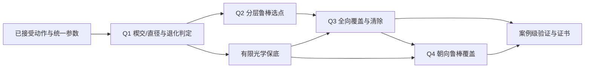

# 整题候选策略登记

Status: design-stage; no benchmark results. 共用模型见 SHARED_MODEL_BACKBONE.md。

本会话没有发现独立 bzd-modeling-ideas Skill，也未发现本地模型字典；以下是依据已审核任务画像独立编制的兼容候选登记，不声称调用了缺失能力。已读取模型卡库的鲁棒/Pareto族；不强行套用学习模型。

## 任务图与跨问题接口

Q1不使用未知源位置；Q2消费Z1/F1而非真实G，以J(q)评价near/direction/no_signal，r两次检测保持同一未知常数；Q3七点集合固定、访问顺序滚动重规划并复用覆盖点作Q2测向；Q4只替换覆盖和负观测推理，复用清除及计时。正式评估的N永不回流策略。所有常数读取唯一参数表，新增超参数单独登记。

## 候选与独立增量

| ID | 状态 | 方法与责任 | 基线/公平比较 | 失败风险与回退 |
| --- | --- | --- | --- | --- |
| GEO | formal_base（设计） | LP分类+边界交点枚举直径 | 解析矩形、三角形及独立半平面交 | 近退化数值不可信时高精度或返回uncertain |
| SAFE | formal_base（设计） | 固定全覆盖扫描+225点光学保底 | 同一目标、相同数据、同一预算，无局部优化 | 墙钟不足报告未完成，不能造证书 |
| ACTIVE | audit_candidate | Q2分层J(q)选点+有界优化预算+SAFE | 对同案例SAFE比较总T、全清率、调用数；新增定位效率 | 无信号/收缩弱/600秒预算触发SAFE |
| ORDER | audit_candidate | 在保留覆盖点集合下调序或早删已清频道 | 对ACTIVE消融顺序，保持同一覆盖义务 | 错删未认证频道会破坏全清，回固定顺序 |
| POINT_LS | audit_candidate | 最小二乘点估计只作局部中心候选 | 比较中心实际最坏半径；不能替代集合证书 | 硬误差不保证无偏，回包络中心 |

全局高维POMDP、强化学习不作为本轮主模型：没有训练案例、误差概率模型及在线算力证据。CRLB仅作交会几何动机，不能给本题有界误差提供概率保证。无需机械补齐第三个主模型。

## 可证伪改进

ACTIVE只主张待检验的效率增量：预测同种子场景下较SAFE减少T和clear调用；不预填百分比。ORDER检验路径长度与切频数。任何增量必须同时保留全清证书、实际墙钟预算和失败案例。若收益不可辨识，主方案保留SAFE，ACTIVE仅作审计候选。没有循环依赖或真值泄漏。
